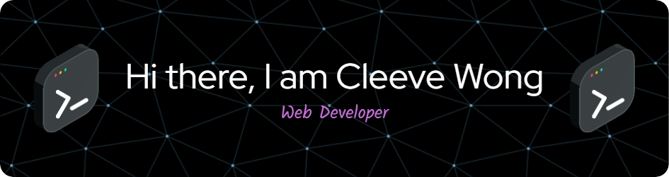

Welcome to my GitHub profile! I'm a passionate **Front-End Developer** who loves to build clean, user-friendly web applications. Here's a little about me:

## 🚀 What I'm Up To

-🔭 **Currently working on:** PhoneHub – an eCommerce web app that sells phones and accessories.
-🌱 **Currently learning:** AWS and cloud computing to expand my backend skills.
-👯 **Looking to collaborate on:** Open-source projects and cutting-edge web applications.
-🤝 **Open to:** Freelance projects, mentorship, and tech talks.
-💬 **Ask me about:** Front-end development, responsive design, and modern web technologies.
-📫 **Reach me at:** cleevephilip.wong@hcdc.edu.ph
-😄 **Pronouns:** He/Him
-⚡ **Fun fact:** I love combining technology with creativity to build engaging digital experiences!

## 🛠️ Technologies & Tools

Here are some of the technologies and tools I work with:

  
  
  
  
  
  
  
  
  
  
  
  
  
  
  
  
  
  
  
  
  
  
  
  
  
  
  
  
  

## 📈 GitHub Stats

## 🏆 GitHub Trophies

## 📚 Featured Projects

Here are some of the projects I'm proud of:

🚀 PhoneHub (In Progress)

🔹 A smart phone management system for better connectivity and device control. https://github.com/CleevePhilip/PhoneHub

🛍️ Dress Code Scanner

🔹 A computer vision-based system to enforce dress code policies using AI. https://github.com/CleevePhilip/DresScan

## 🌟 Support Me

If you find my work interesting or helpful, consider supporting me:

## 📫 Let's Connect!

I'm always open to interesting conversations, collaborations, or just a friendly chat. Feel free to reach out to me via:

- **Email:** cleevephilip.wong@hcdc.edu.ph
- **LinkedIn:** https://www.linkedin.com/in/cleeve-philip-wong-251b33279/
- **Portfolio:** https://portfoliocleeve.vercel.app/

---

⭐️ From [Cleeve Wong](https://github.com/CleevePhilip) 
